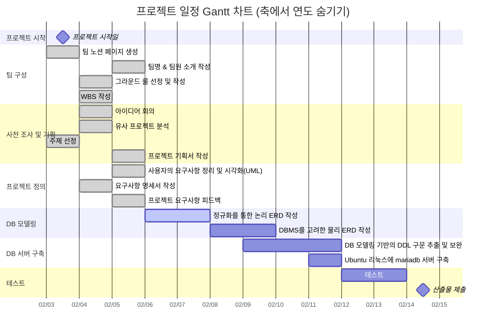

## Project Gannt Chart

```mermaid
gantt
dateFormat  YYYY-MM-DD
axisFormat  %m/%d
title 프로젝트 일정 Gantt 차트 (축에서 연도 숨기기)

section 프로젝트 시작
프로젝트 시작일 :milestone, 2025-02-03, 1d

section 팀 구성
팀 노션 페이지 생성       :done, 2025-02-03, 1d
팀명 & 팀원 소개 작성     :done, 2025-02-05, 1d
그라운드 룰 선정 및 작성  :done, 2025-02-04, 1d
WBS 작성                :done, 2025-02-04, 1d

section 사전 조사 및 기획
아이디어 회의            :done, 2025-02-04, 1d
유사 프로젝트 분석       :done, 2025-02-04, 1d
주제 선정               :done, 2025-02-03, 1d
프로젝트 기획서 작성     :done, 2025-02-05, 1d

section 프로젝트 정의
사용자의 요구사항 정리 및 시각화(UML) :done, 2025-02-05, 1d
요구사항 명세서 작성                 :done, 2025-02-04, 1d
프로젝트 요구사항 피드백            :done, 2025-02-05, 1d

section DB 모델링
정규화를 통한 논리 ERD 작성          :active, 2025-02-06, 2025-02-08
DBMS를 고려한 물리 ERD 작성         :2025-02-08, 2025-02-10

section DB 서버 구축
DB 모델링 기반의 DDL 구문 추출 및 보완 :2025-02-09, 2025-02-12
Ubuntu 리눅스에 mariadb 서버 구축     :2025-02-11, 2025-02-12

section 테스트
테스트                  :2025-02-12, 2025-02-14
산출물 제출             :milestone, 2025-02-14, 1d
```
