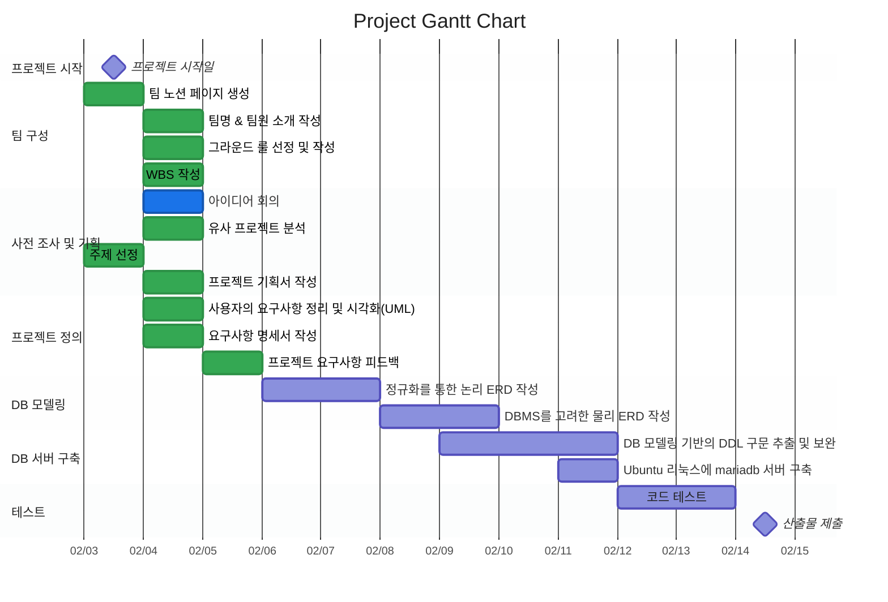

## Project Gannt Chart

```mermaid
%%{init: {
  'theme': 'default',
  'themeVariables': {
    'primaryColor': '#4285f4',
    'primaryTextColor': '#fff',
    'primaryBorderColor': '#4285f4',
    'lineColor': '#9e9e9e',
    'textColor': '#212121',
    'taskTextColor': '#212121',
    'taskTextOutsideColor': '#333',
    'sectionBkgColor': '#f8f9fa',
    'sectionBkgColor2': '#f1f3f4',
    'activeTaskBkgColor': '#34a853',
    'activeTaskBorderColor': '#2d9147',
    'doneTaskBkgColor': '#1a73e8',
    'doneTaskBorderColor': '#1557b0',
    'gridColor': '#e0e0e0',
    'todayLineColor': '#ea4335'
  }
}}%%

gantt
dateFormat  YYYY-MM-DD
axisFormat  %m/%d
title Project Gantt Chart

section 프로젝트 시작
프로젝트 시작일 :milestone, m1, 2025-02-03, 1d

section 팀 구성
팀 노션 페이지 생성       :active, 2025-02-03, 1d
팀명 & 팀원 소개 작성     :active, 2025-02-04, 1d
그라운드 룰 선정 및 작성  :active, 2025-02-04, 1d
WBS 작성                :active, 2025-02-04, 1d

section 사전 조사 및 기획
아이디어 회의            :done, 2025-02-04, 1d
유사 프로젝트 분석       :active, 2025-02-04, 1d
주제 선정               :active, 2025-02-03, 1d
프로젝트 기획서 작성     :active, 2025-02-04, 1d

section 프로젝트 정의
사용자의 요구사항 정리 및 시각화(UML) :active, 2025-02-04, 1d
요구사항 명세서 작성                 :active, 2025-02-04, 1d
프로젝트 요구사항 피드백            :active, 2025-02-05, 1d

section DB 모델링
정규화를 통한 논리 ERD 작성          :2025-02-06, 2025-02-08
DBMS를 고려한 물리 ERD 작성         :2025-02-08, 2025-02-10

section DB 서버 구축
DB 모델링 기반의 DDL 구문 추출 및 보완 :2025-02-09, 2025-02-12
Ubuntu 리눅스에 mariadb 서버 구축     :2025-02-11, 2025-02-12

section 테스트
코드 테스트                  :2025-02-12, 2025-02-14
산출물 제출             :milestone, m2, 2025-02-14, 1d
```
